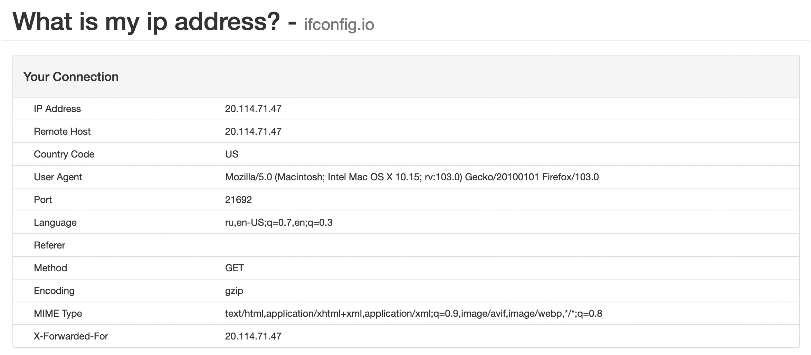

# tailscale-github-actions

Just one of example for using Github actions as Tailscale exit nodes.

## Setup

You need to create ephemeral key on Tailscale control panel, after that write it
on secrets in repository with name `TAILSCALE_AUTHKEY`.

After push new node was added to Tailscale. Just enable exit node and connect
to it.
